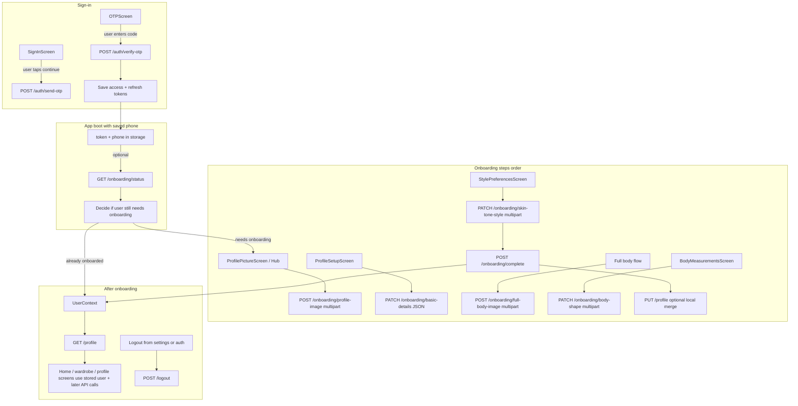
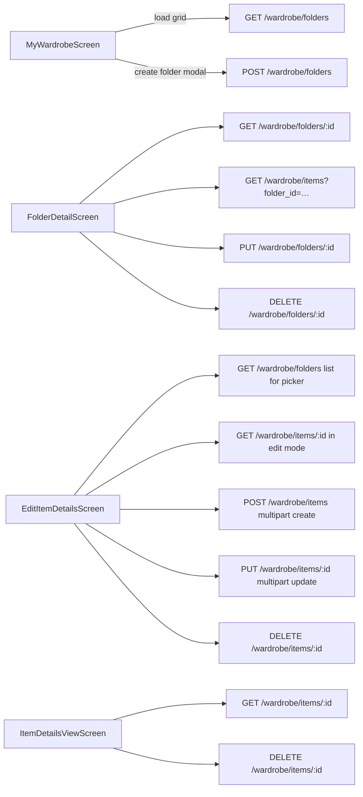
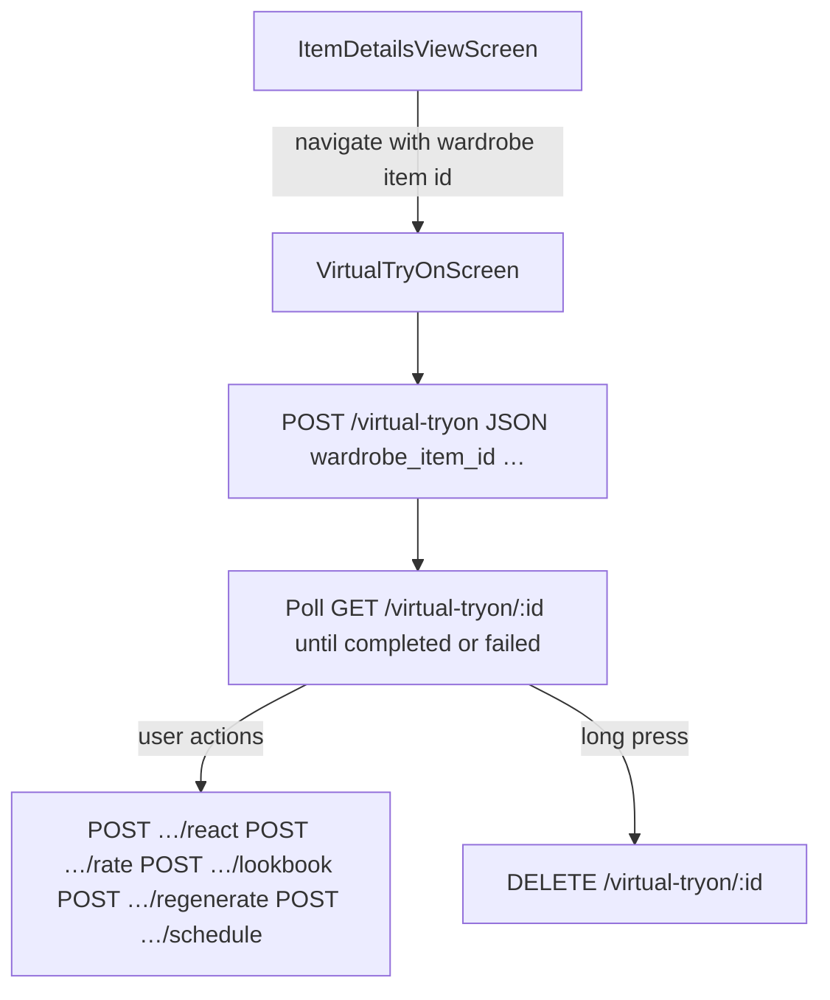

# SOS API integration guide — plain English

This document explains **which backend API is used where in the app**, **why it exists**, **how calls flow together**, and **what is left to build**. It is written for **product**, **QA**, and **developers** who need the same mental model.

The official contract is the **Hoppscotch “Mobile API V1”** collection, saved offline as:

- **`docs/completeAPIDocumentation.html`**

Live viewer (may need a login in the browser):  
https://api.styleonspot.com/view/f2fb9ef4-e921-404c-949d-4daf9f445155/CURRENT

The running app code lives in **`sos-app/`**: paths in **`src/api/endpoints.ts`**, HTTP in **`src/api/client.ts`**, typed calls in **`src/services/*`**, UI in **`src/screens/*`**, and shared session/user state in **`src/store/*`**.

**Full technical catalog** (every exported route, sample bodies, cURL, auth, integration status): **`docs/SOS_BACKEND_API_REFERENCE.md`**.

---

## 1. Simple words we use

| Term | Meaning |
|------|--------|
| **Endpoint** | A URL path under the API root, for example `/auth/send-otp`. The full URL is your base (for example `https://app.styleonspot.com/api/v1`) plus that path. |
| **Screen** | One React Native screen file under `sos-app/src/screens/…` (what the user sees). |
| **Service** | A small module under `sos-app/src/services/` that knows **one area** of the API (auth, user, wardrobe folders, items, virtual try-on, payments). Screens should call **services**, not `fetch` directly. |
| **Bearer token** | A secret string returned after OTP verify. The app stores it and sends `Authorization: Bearer …` on most calls. `apiClient` does this for you. |
| **Refresh** | If a call returns 401, `apiClient` can call **`POST /auth/refresh-token`** once and retry. |

---

## 2. The one rule that keeps the app maintainable

**All app API traffic goes through `apiClient` + `src/services/*`.**  
Screens stay focused on UI (loading, buttons, errors). Services stay focused on URLs, bodies, and mapping JSON into app models.

---

## 3. How the backend usually answers

Most responses look like:

```json
{
  "success": true,
  "data": { },
  "message": "Short human text"
}
```

Services unwrap **`data`** and turn it into typed objects. Errors are normalized in **`src/api/errors.ts`** so the UI can show **safe** messages (see **`notify`** on screens).

---

## 4. Big picture: API flow in the app

**Plain story:** the user signs in with a phone OTP, completes onboarding steps (photos and profile fields), then uses the main app. The main app loads **profile** after onboarding, uses **wardrobe** APIs for folders and items, and can start **virtual try-on** jobs. Signing out calls **logout**.

### 4.1 Flowchart — from install to main app



### 4.2 Flowchart — wardrobe: folders and items



### 4.3 Flowchart — virtual try-on from an item



---

## 5. Which screen uses which API (and why)

Below, **“Why”** is always from the user’s point of view: what problem the call solves.

### 5.1 Auth screens

| Screen / component | What the user does | Service | Endpoint | Why |
|--------------------|--------------------|---------|----------|-----|
| **SignInScreen** (+ `useAuthViewModel`) | Enters phone, taps to get OTP | `authService` via **`AuthContext.login`** | `POST /auth/send-otp` | Backend sends OTP to that phone. |
| **OTPScreen** (+ `useOTPViewModel`) | Enters OTP | **`AuthContext.verifyOTP`** | `POST /auth/verify-otp` | Proves ownership of the phone; returns tokens. |
| **OTPScreen** | Taps resend | **`AuthContext.resendOTP`** | `POST /auth/resend-otp` (if that returns 404/405, **`authService`** falls back to **`POST /auth/send-otp`**) | Sends a fresh OTP even when only one path exists on the server. |

**Not a screen:** when the app starts with a saved phone, **`AuthContext`** may call **`GET /onboarding/status`** so the server is the source of truth for “has this user finished onboarding?”.

### 5.2 Onboarding screens (step order)

| Screen | What the user does | Service | Endpoint | Why |
|--------|--------------------|---------|----------|-----|
| **ProfilePictureScreen** (and **ProfileSetupHubScreen** quick path) | Picks or captures profile photo | `userService.uploadProfileImage` | `POST /onboarding/profile-image` (multipart **`profile_image`**) | Stores the face/avatar reference for styling. |
| **ProfileSetupScreen** | Enters name, height, weight, DOB, etc. | `userService.saveOnboardingBasicDetails` | `PATCH /onboarding/basic-details` | Server needs structured profile fields for recommendations. |
| **FullBodyPhotoPreviewScreen** (after camera/gallery) | Confirms full-body photo | `userService.uploadFullBodyImage` | `POST /onboarding/full-body-image` (multipart **`full_body_image`**) | Try-on and fit features need a body reference; image is resized client-side to avoid upload errors. |
| **BodyMeasurementsScreen** | Picks body shape (and optional custom label) | `userService.saveOnboardingBodyShape` | `PATCH /onboarding/body-shape` | Silhouette drives how clothes are suggested. |
| **StylePreferencesScreen** | Picks skin tone + style tags (server-driven options) | `userService.getOnboardingOptions`, `userService.saveOnboardingSkinToneStyle` | `GET /onboarding/options`, `PATCH /onboarding/skin-tone-style` | Palette and style tags tune recommendations and try-on. |
| **BodyMeasurementsScreen** | Picks body shape (server-driven options + custom) | `userService.getOnboardingOptions`, `userService.saveOnboardingBodyShape` | `GET /onboarding/options`, `PATCH /onboarding/body-shape` | Uses backend shape keys for consistent silhouette mapping. |
| **StylePreferencesScreen** (finish / skip paths) | Finishes onboarding | **`AuthContext.completeOnboarding`** → `userService.markOnboardingComplete` | `POST /onboarding/complete` | Marks the account as ready for the main app. |
| **StylePreferencesScreen** | May merge local fields | `userService.updateProfile` / **`UserContext.updateProfile`** | `PUT /profile` | Keeps **`GET /profile`** in sync when you change fields that also live on the user record. |

### 5.3 Profile and settings

| Screen | What the user does | Service | Endpoint | Why |
|--------|--------------------|---------|----------|-----|
| **EditProfileScreen** (and similar) | Saves name, etc. | **`UserContext.updateProfile`** → `userService.updateProfile` | `PUT /profile` | Single place to update fields the server stores for “me”. |
| **Profile / settings flows** | Pull to refresh or re-enter app | **`UserContext.refreshProfile`** | `GET /profile` | Shows latest name, images, flags from server. |

### 5.4 Wardrobe screens

| Screen | What the user does | Service | Endpoint | Why |
|--------|--------------------|---------|----------|-----|
| **MyWardrobeScreen** | Opens wardrobe tab | `wardrobeFolderService.listFolders` | `GET /wardrobe/folders` | Shows folder grid. |
| **CreateFolderModal** | Creates a folder | `wardrobeFolderService.createFolder` | `POST /wardrobe/folders` | User organizes items into folders. |
| **FolderDetailScreen** | Opens a folder | `wardrobeFolderService.getFolderDetails` | `GET /wardrobe/folders/:id` | Folder header and metadata. |
| **FolderDetailScreen** | Sees items in folder | `wardrobeItemService.listItems` | `GET /wardrobe/items?folder_id=…` | Lists pieces in that folder. |
| **FolderDetailScreen** | Renames / edits folder | `wardrobeFolderService.updateFolder` | `PUT /wardrobe/folders/:id` | Keeps titles and order accurate. |
| **FolderDetailScreen** | Deletes folder | `wardrobeFolderService.deleteFolder` | `DELETE /wardrobe/folders/:id` | User removes an empty or unwanted folder. |
| **EditItemDetailsScreen** | Create item | `wardrobeItemService.createItem` | `POST /wardrobe/items` (multipart) | Adds a new piece with image and fields. |
| **EditItemDetailsScreen** | Edit item | `wardrobeItemService.getItem` / `updateItem` | `GET` + `PUT /wardrobe/items/:id` | Load and save one piece. |
| **EditItemDetailsScreen** | Delete item | `wardrobeItemService.deleteItem` | `DELETE /wardrobe/items/:id` | Removes a piece. |
| **ItemDetailsViewScreen** | Opens item | `wardrobeItemService.getItem` | `GET /wardrobe/items/:id` | Fresh details for the detail page. |
| **ItemDetailsViewScreen** | Deletes item | `wardrobeItemService.deleteItem` | `DELETE /wardrobe/items/:id` | Same as edit flow. |
| **ItemDetailsViewScreen** | Taps Virtual Try-On | Navigates to **VirtualTryOnScreen** (no HTTP on this button alone) | — | Next screen starts try-on API (see below). |

**Service ready, UI not fully wired:** **`GET /wardrobe/search`** (`wardrobeItemService.searchItems`) — use when you add a global search bar or filters screen.

**In the official doc but not in the app yet:** folder **reorder**, item **bulk delete**, **track usage**, **analytics**, **items-usage** routes — see section 8.

### 5.5 Virtual try-on screen

| Screen | User action | Service | Endpoint | Why |
|--------|-------------|---------|----------|-----|
| **VirtualTryOnScreen** | Opens with a **numeric** `wardrobeItemId` from item details | `initiateVirtualTryOn` | `POST /virtual-tryon` | Starts a generation job on the server. |
| **VirtualTryOnScreen** | Waits on result | `getVirtualTryOn` on a timer | `GET /virtual-tryon/:id` | Job is async; polling discovers `completed` or `failed`. |
| **VirtualTryOnScreen** | Pull to refresh | `getVirtualTryOn` | `GET /virtual-tryon/:id` | Manual refresh of status. |
| **VirtualTryOnScreen** | Heart / thumbs | `reactVirtualTryOn` | `POST /virtual-tryon/:id/react` | Stores like/dislike feedback. |
| **VirtualTryOnScreen** | Star | `rateVirtualTryOn` | `POST /virtual-tryon/:id/rate` | Stores 1–5 rating (app toggles 5 / clear for now). |
| **VirtualTryOnScreen** | Bookmark | `saveVirtualTryOnToLookbook` | `POST /virtual-tryon/:id/lookbook` | Saves result to lookbook. |
| **VirtualTryOnScreen** | Shuffle | `regenerateVirtualTryOn` | `POST /virtual-tryon/:id/regenerate` | Asks for another render. |
| **VirtualTryOnScreen** | Calendar confirm | `scheduleVirtualTryOn` | `POST /virtual-tryon/:id/schedule` | Schedules a reminder datetime. |
| **VirtualTryOnScreen** | Long-press hero image → delete | `deleteVirtualTryOn` | `DELETE /virtual-tryon/:id` | Removes that try-on record. |

**Optional route param:** `existingTryOnId` — opens an existing job instead of creating a new one (good for deep links later).

**List history:** `GET /virtual-tryon` is implemented in **`listVirtualTryOns`** but there is **no history list UI** yet.

**Home / outfit cards:** try-on only auto-starts if **`outfit.id`** is a **numeric** server id. Mock outfits may not qualify; opening try-on from **wardrobe item details** is the reliable path today.

### 5.6 Payments (code exists; product flow may vary)

| Area | Service | Endpoints | Notes |
|------|---------|-----------|--------|
| Checkout flows | `paymentService` | `POST /payments/upi/verify`, `/payments/upi/pay`, `/payments/card/charge`, `/payments/net-banking/charge`, `/payments/paypal/charge` | Wire these from the **subscription or checkout screen** you ship; they are **not** in the saved Hoppscotch HTML export. |

---

## 6. APIs that run from “global” places (not one screen)

| Place | APIs | Why |
|-------|------|-----|
| **`AuthContext`** | `POST /auth/send-otp`, `POST /auth/verify-otp`, `GET /onboarding/status`, `POST /onboarding/complete` (via `userService.markOnboardingComplete`), `POST /logout` (+ fallback `POST /auth/logout`) | One place for login state, onboarding completion, and logout side-effects. |
| **`UserContext`** | `GET /profile`, `PUT /profile`, sometimes `POST /users/me/profile-setup` (`saveProfileSetup`) | Keeps the “current user” object aligned with the server after onboarding. |
| **`OutfitContext`** | `GET /wardrobe/outfits`, `GET /wardrobe/saved-outfits`, save/unsave posts | Home and outfit browsing; may 404 if the route is not deployed — the app degrades gracefully. |
| **`apiClient` (internal)** | `POST /auth/refresh-token` | Automatic session extension on 401. |

---

## 7. Questions people actually ask (FAQ)

**Q: Why do we have both `/logout` and `/auth/logout`?**  
A: The official doc uses **`POST /logout`**. The app tries that first, then falls back to the older path if needed.

**Q: Why must `EXPO_PUBLIC_API_BASE_URL` end with `/api/v1`?**  
A: Every path in `endpoints.ts` is **relative** to that root. If you add `/v1` twice, you get `/api/v1/v1/...` and 404s.

**Q: Why are images uploaded as multipart?**  
A: The backend expects file fields (`profile_image`, `full_body_image`, wardrobe `image`, etc.). JSON cannot carry raw files efficiently.

**Q: Why does Virtual Try-On “spin” for a while?**  
A: **`POST /virtual-tryon`** returns a **job** (`pending`). The UI polls **`GET /virtual-tryon/:id`** until the server sets `completed` or `failed`.

**Q: Can I call `fetch` from a screen?**  
A: Please do not. Use **`apiClient`** inside **`services/*`** so timeouts, refresh, and logging stay consistent.

**Q: Where do I show errors?**  
A: Use **`notify`** (toast/alert) plus **`logSosError`** in services for debugging. Never show raw SQL or stack traces to users.

**Q: What is `GET /profile` for vs onboarding PATCH routes?**  
A: Onboarding routes **fill the first-time setup**. **`GET/PUT /profile`** is the **ongoing “my account”** record after that.

**Q: Why does `UserContext` skip `GET /profile` until `isOnboarded`?**  
A: Some backends return 403 for users still in onboarding. The app avoids that call until the flag says the user is allowed.

**Q: What about sessions list in the doc (`GET /sessions`)?**  
A: Not wired. Today, **logout** ends the app session. A future “devices” screen could list and revoke sessions.

**Q: What is the fastest way to add a new API?**  
A: Read the HTML doc → add path in **`endpoints.ts`** → add a function in the right **`service`** → call it from **one** screen or context → update this guide and **`memory.md`**.

---

## 8. What is already done vs what is sensible next

| Status | Item |
|--------|------|
| Done | Auth OTP, refresh, logout; onboarding steps 1–6; profile GET/PUT; wardrobe folders CRUD; wardrobe items CRUD + folder filter; item detail fetch/delete; virtual try-on initiate + poll + react/rate/lookbook/regenerate/schedule/delete. |
| Done in code, check UI wiring | Wardrobe **search** service — connect search field / filters screen. |
| Next (doc has it, app does not) | **`GET /onboarding/options`** for server-driven labels. |
| Next | **`GET /virtual-tryon`** history list UI; **`POST /wardrobe/folders/reorder`**; **bulk delete**, **track usage**, **analytics**, **items-usage** family. |
| Next | **`GET /sessions`** / **`DELETE /sessions/:id`** if you want device management. |
| Next | Payment screens fully wired to **`paymentService`** end-to-end with test cards and receipts. |
| Ongoing | Keep **`docs/completeAPIDocumentation.html`** updated when Hoppscotch changes so this file stays honest. |

---

## 9. For developers: base URL and response shape (short)

- **Env:** `EXPO_PUBLIC_API_BASE_URL` → must be like `https://app.styleonspot.com/api/v1` (no duplicate `/v1` in each path).
- **Envelope:** `{ success, data, message }` — unwrap in services.
- **Playbook:** doc → `endpoints.ts` → `services/<x>Service.ts` → screen/context → `notify` + loading + update **`memory.md`** when behavior changes.

---

## 10. Appendix — endpoint cheat sheet (by area)

| Area | Methods and paths (relative to `/api/v1`) |
|------|-------------------------------------------|
| Auth | `POST /auth/send-otp`, `POST /auth/verify-otp`, `POST /auth/resend-otp`, `POST /auth/refresh-token` |
| Session | `POST /logout` (and optional doc: `GET/DELETE /sessions…` — not wired) |
| Onboarding | `GET /onboarding/status`, `GET /onboarding/options` (doc only), `POST …/profile-image`, `PATCH …/basic-details`, `POST …/full-body-image`, `PATCH …/body-shape`, `PATCH …/skin-tone-style`, `POST …/complete` |
| Profile | `GET /profile`, `PUT /profile`, legacy `POST /users/me/profile-setup` |
| Wardrobe | `…/wardrobe/folders`, `…/folders/:id`, `…/folders/reorder` (not wired), `…/wardrobe/items`, `…/items/:id`, `…/items/:id/image`, `…/items/bulk-delete` (not wired), `GET /wardrobe/search`, analytics + items-usage (not wired) |
| Outfits (app) | `GET/POST /wardrobe/outfits`, `GET/POST/DELETE …/saved-outfits` — confirm deployment |
| Virtual try-on | `GET/POST /virtual-tryon`, `GET/DELETE /virtual-tryon/:id`, `POST …/react`, `…/rate`, `…/regenerate`, `…/lookbook`, `…/schedule` |
| Payments (app) | `/payments/upi/verify`, `/payments/upi/pay`, `/payments/card/charge`, `/payments/net-banking/charge`, `/payments/paypal/charge` |

---

## 11. Document history

| Date | What changed |
|------|----------------|
| 2026-04-18 | First structured guide from Hoppscotch HTML + `endpoints.ts`. |
| 2026-04-18 | Virtual try-on service + screen wired. |
| 2026-04-18 | **This revision:** plain-English “who / why / where”, screen→endpoint tables, FAQ, what’s next, and **multiple flowcharts** for auth, wardrobe, and try-on. |
| 2026-04-18 | Added **`docs/SOS_BACKEND_API_REFERENCE.md`** + **`.cursor/rules/sos-backend-api-reference.mdc`** as the single deep backend reference for agents. |
