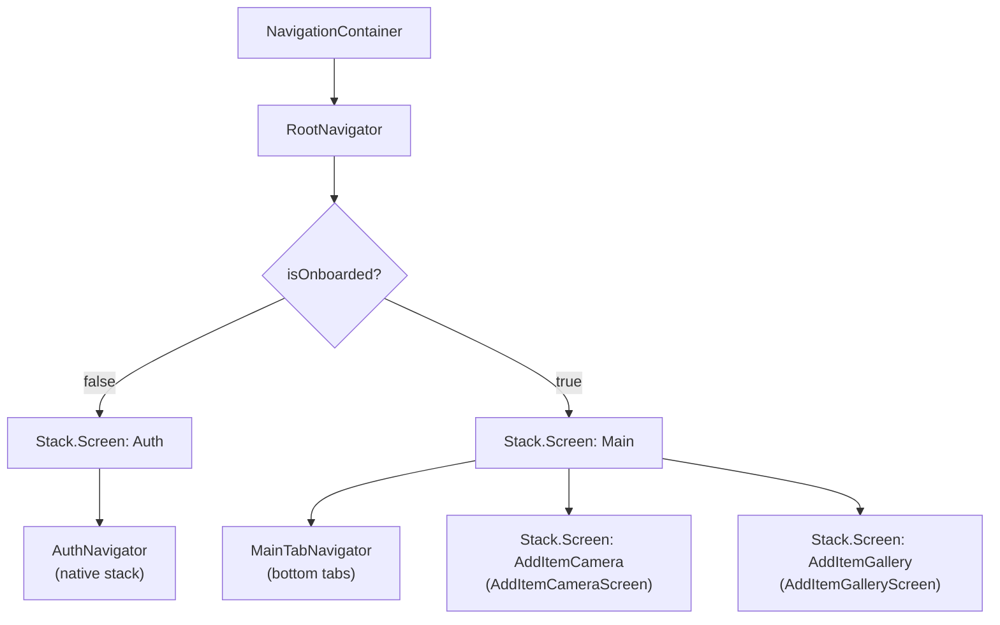
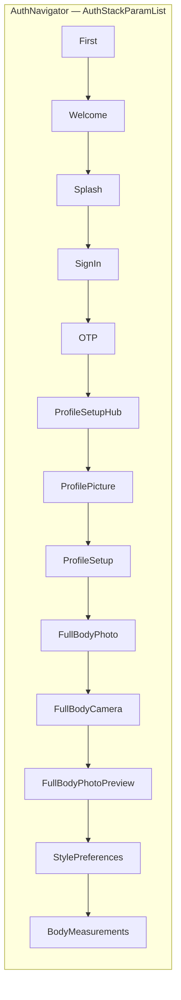
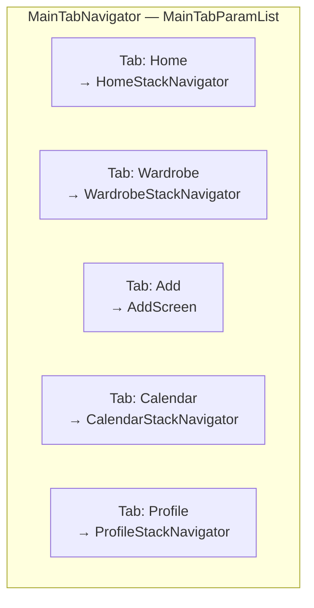
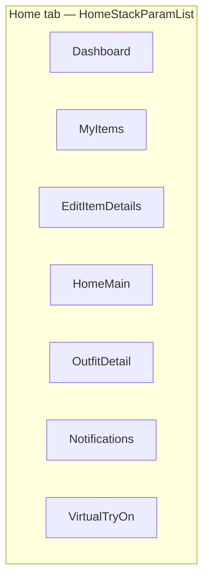
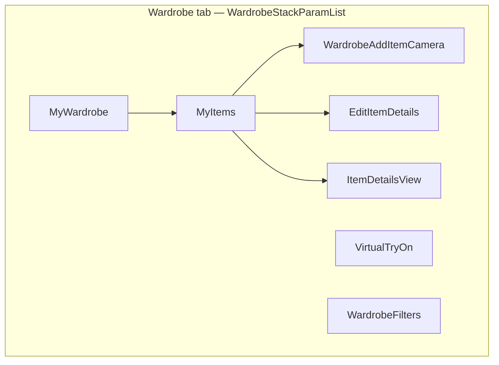
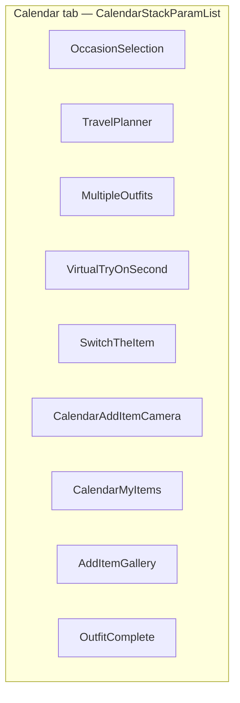
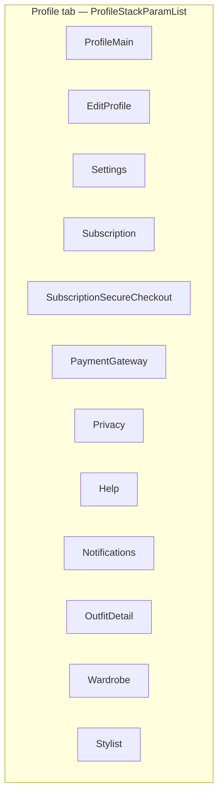
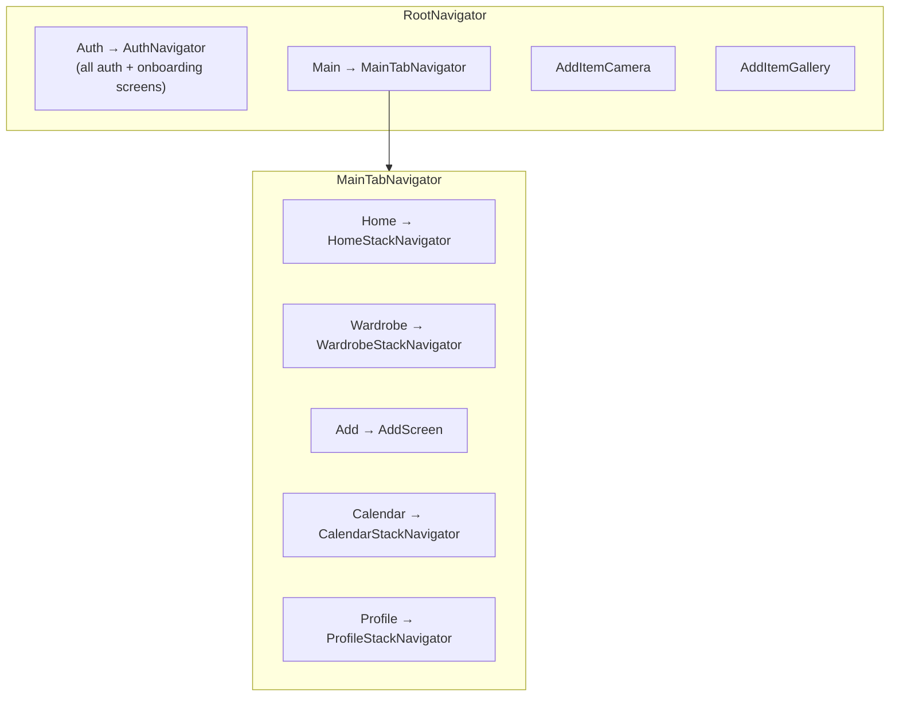

# SOS App — Navigation map & screen names

**Project:** `sos-app` (React Native / Expo, React Navigation v7)  
**Entry:** `NavigationContainer` → `RootNavigator` (`src/navigation/RootNavigator.tsx`)

Use this file as the single reference for **route names** (what you pass to `navigate('…')`) vs **screen components** (the `*.tsx` file).

---

## 1. Top-level switch (root)

`RootNavigator` shows either the **Auth** tree or **Main + global modals**, driven by `useAuth().state.isOnboarded` (see `AuthContext`).

**Root route names:** `Auth` | `Main` | `AddItemCamera` | `AddItemGallery`

---

## 2. Auth flow (`AuthNavigator`)

`initialRouteName`: **First**

| Route name | Screen component | File |
|------------|------------------|------|
| `First` | FirstScreen | `screens/onboarding/FirstScreen.tsx` |
| `Welcome` | WelcomeScreen | `screens/auth/WelcomeScreen.tsx` |
| `Splash` | SplashScreen | `screens/auth/SplashScreen.tsx` |
| `SignIn` | SignInScreen | `screens/auth/SignInScreen.tsx` |
| `OTP` | OTPScreen | `screens/auth/OTPScreen.tsx` |
| `ProfileSetupHub` | ProfileSetupHubScreen | `screens/onboarding/ProfileSetupHubScreen.tsx` |
| `ProfilePicture` | ProfilePictureScreen | `screens/onboarding/ProfilePictureScreen.tsx` |
| `ProfileSetup` | ProfileSetupScreen | `screens/onboarding/ProfileSetupScreen.tsx` |
| `FullBodyPhoto` | FullBodyPhotoScreen | `screens/onboarding/FullBodyPhotoScreen.tsx` |
| `FullBodyCamera` | FullBodyCameraScreen | `screens/onboarding/FullBodyCameraScreen.tsx` |
| `FullBodyPhotoPreview` | FullBodyPhotoPreviewScreen | `screens/onboarding/FullBodyPhotoPreviewScreen.tsx` |
| `StylePreferences` | StylePreferencesScreen | `screens/onboarding/StylePreferencesScreen.tsx` |
| `BodyMeasurements` | BodyMeasurementsScreen | `screens/onboarding/BodyMeasurementsScreen.tsx` |

---

## 3. Main app — bottom tabs (`MainTabNavigator`)

`initialRouteName`: **Home**

| Tab route | Navigator / screen |
|-----------|---------------------|
| `Home` | `HomeStackNavigator` |
| `Wardrobe` | `WardrobeStackNavigator` |
| `Add` | `AddScreen` (no nested stack) |
| `Calendar` | `CalendarStackNavigator` |
| `Profile` | `ProfileStackNavigator` |

Custom tab UI: `src/navigation/components/CustomTabBar.tsx`

---

## 4. Home stack (`HomeStackNavigator`)

`initialRouteName`: **Dashboard**

| Route name | Screen component | File |
|------------|------------------|------|
| `Dashboard` | DashboardScreen | `screens/home/DashboardScreen.tsx` |
| `MyItems` | MyItemsScreen | `screens/wardrobe/MyItemsScreen.tsx` |
| `EditItemDetails` | EditItemDetailsScreen | `screens/wardrobe/EditItemDetailsScreen.tsx` |
| `HomeMain` | HomeScreen | `screens/home/HomeScreen.tsx` |
| `OutfitDetail` | OutfitDetailScreen | `screens/outfit/OutfitDetailScreen.tsx` |
| `Notifications` | NotificationsScreen | `screens/notifications/NotificationsScreen.tsx` |
| `VirtualTryOn` | VirtualTryOnScreen | `screens/tryon/VirtualTryOnScreen.tsx` |

**Note:** Same **route name strings** can exist in other stacks (e.g. `MyItems`, `EditItemDetails`) — navigation is **scoped to the active stack**.

---

## 5. Wardrobe stack (`WardrobeStackNavigator`)

`initialRouteName`: **MyWardrobe**

| Route name | Screen component | File |
|------------|------------------|------|
| `MyWardrobe` | MyWardrobeScreen | `screens/wardrobe/MyWardrobeScreen.tsx` |
| `MyItems` | MyItemsScreen | `screens/wardrobe/MyItemsScreen.tsx` |
| `WardrobeAddItemCamera` | WardrobeAddItemCameraScreen | `screens/wardrobe/WardrobeAddItemCameraScreen.tsx` |
| `VirtualTryOn` | VirtualTryOnScreen | `screens/tryon/VirtualTryOnScreen.tsx` |
| `EditItemDetails` | EditItemDetailsScreen | `screens/wardrobe/EditItemDetailsScreen.tsx` |
| `ItemDetailsView` | ItemDetailsViewScreen | `screens/wardrobe/ItemDetailsViewScreen.tsx` |
| `WardrobeFilters` | WardrobeFiltersScreen | `screens/wardrobe/WardrobeFiltersScreen.tsx` |

Shared params types: `src/navigation/wardrobeNavParams.ts`, `src/navigation/virtualTryOnRouteParams.ts`

---

## 6. Calendar stack (`CalendarStackNavigator`)

`initialRouteName`: **OccasionSelection**

| Route name | Screen component | File |
|------------|------------------|------|
| `OccasionSelection` | OccasionSelectionScreen | `screens/calendar/OccasionSelectionScreen.tsx` |
| `TravelPlanner` | TravelPlannerScreen | `screens/calendar/TravelPlannerScreen.tsx` |
| `MultipleOutfits` | MultipleOutfitsScreen | `screens/calendar/MultipleOutfitsScreen.tsx` |
| `VirtualTryOnSecond` | VirtualTryOnSecondScreen | `screens/calendar/VirtualTryOnSecondScreen.tsx` |
| `SwitchTheItem` | SwitchTheItemScreen | `screens/calendar/SwitchTheItemScreen.tsx` |
| `CalendarAddItemCamera` | CalendarAddItemCameraScreen | `screens/calendar/CalendarAddItemCameraScreen.tsx` |
| `CalendarMyItems` | MyItemsScreen | `screens/wardrobe/MyItemsScreen.tsx` |
| `AddItemGallery` | AddItemGalleryScreen | `screens/wardrobe/AddItemGalleryScreen.tsx` |
| `OutfitComplete` | OutfitCompleteScreen | `screens/calendar/OutfitCompleteScreen.tsx` |

---

## 7. Profile stack (`ProfileStackNavigator`)

`initialRouteName`: default first screen **ProfileMain**

| Route name | Screen component | File |
|------------|------------------|------|
| `ProfileMain` | ProfileScreen | `screens/profile/ProfileScreen.tsx` |
| `EditProfile` | EditProfileScreen | `screens/profile/EditProfileScreen.tsx` |
| `Settings` | SettingsScreen | `screens/settings/SettingsScreen.tsx` |
| `Subscription` | SubscriptionScreen | `screens/profile/SubscriptionScreen.tsx` |
| `SubscriptionSecureCheckout` | SubscriptionSecureCheckoutScreen | `screens/profile/SubscriptionSecureCheckoutScreen.tsx` |
| `PaymentGateway` | PaymentGatewayScreen | `screens/profile/PaymentGatewayScreen.tsx` |
| `Privacy` | PrivacyScreen | `screens/profile/PrivacyScreen.tsx` |
| `Help` | HelpScreen | `screens/profile/HelpScreen.tsx` |
| `Notifications` | NotificationsScreen | `screens/notifications/NotificationsScreen.tsx` |
| `OutfitDetail` | OutfitDetailScreen | `screens/outfit/OutfitDetailScreen.tsx` |
| `Wardrobe` | WardrobeScreen | `screens/wardrobe/WardrobeScreen.tsx` |
| `Stylist` | StylistScreen | `screens/stylist/StylistScreen.tsx` |

---

## 8. Add tab (single screen)

| Route name | Screen component | File |
|------------|------------------|------|
| `Add` | AddScreen | `screens/add/AddScreen.tsx` |

---

## 9. Root modals (over Main, when onboarded)

| Route name | Screen component | File |
|------------|------------------|------|
| `AddItemCamera` | AddItemCameraScreen | `screens/wardrobe/AddItemCameraScreen.tsx` |
| `AddItemGallery` | AddItemGalleryScreen | `screens/wardrobe/AddItemGalleryScreen.tsx` |

Params (see `RootStackParamList`): optional `folderId` on camera/gallery routes.

---

## 10. Combined overview (one diagram)

---

## 11. Search stack (defined, not mounted in Root)

`SearchStackNavigator` (`src/navigation/SearchStackNavigator.tsx`) defines:

| Route name | Screen component | File |
|------------|------------------|------|
| `SearchMain` | SearchScreen | `screens/search/SearchScreen.tsx` |
| `OutfitDetail` | OutfitDetailScreen | `screens/outfit/OutfitDetailScreen.tsx` |

It is **not** referenced by `RootNavigator` or `MainTabNavigator` in the current tree — wire it in if you add a Search entry point.

---

## 12. Source files (navigators)

| File | Role |
|------|------|
| `src/navigation/RootNavigator.tsx` | Root stack + `NavigationContainer` |
| `src/navigation/AuthNavigator.tsx` | Auth + onboarding stack |
| `src/navigation/MainTabNavigator.tsx` | Bottom tabs |
| `src/navigation/HomeStackNavigator.tsx` | Home tab stack |
| `src/navigation/WardrobeStackNavigator.tsx` | Wardrobe tab stack |
| `src/navigation/CalendarStackNavigator.tsx` | Calendar tab stack |
| `src/navigation/ProfileStackNavigator.tsx` | Profile tab stack |
| `src/navigation/SearchStackNavigator.tsx` | Standalone search stack (unused at root) |

---

**Last generated:** from repo navigation files (React Navigation native + bottom tabs). Re-run a quick diff against `*Navigator*.tsx` after large refactors.
